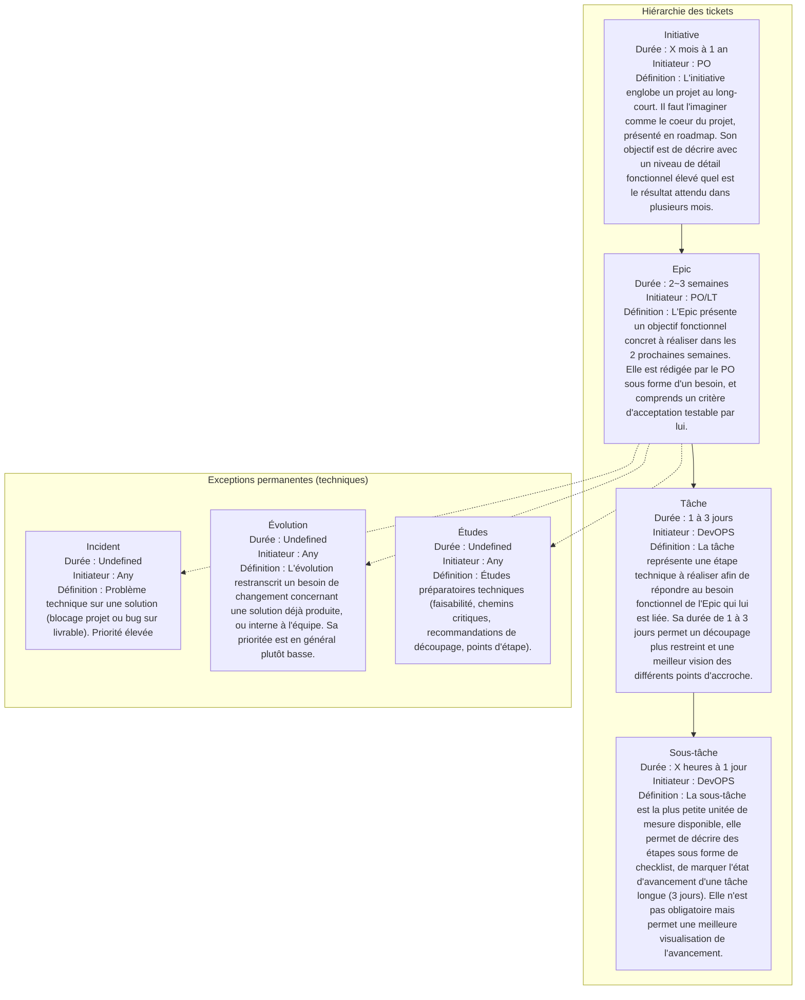
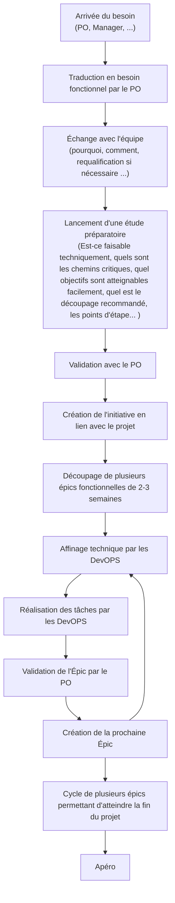
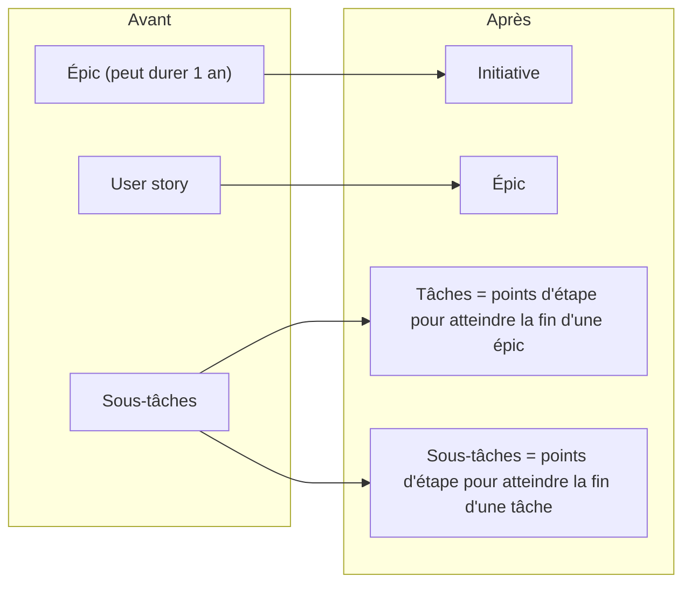

## Restitution des travaux agiles de l'été : définitions, nouvelle organisation, exemples...

## Glossaire

- PO : Project Owner
- LT : Lead Tech

## Définitions

> DISCLAIMER : Les défintions agiles, internes à l'équipe et Jira ne permettant pas de s'aligner correctement, il vous est ici présenté le compromis décidé d'un commun accord entre les pilotes de ce projet de restructuration.

| Type de ticket | Durée recommandée | Initiateur | Définition |
| --- | --- | --- | --- |
| Initiative | X mois à 1 an | PO | L'initiative englobe un projet au long-court. Il faut l'imaginer comme le coeur du projet, présenté en roadmap. Son objectif est de décrire avec un niveau de détail fonctionnel élevé quel est le résultat attendu dans plusieurs mois. |
| Epic | 2~3 semaines | PO/LT | L'Epic présente un objectif fonctionnel concret à réaliser dans les 2 prochaines semaines. Elle est rédigée par le PO sous forme d'un besoin, et comprends un critère d'acceptation testable par lui. |
| Tâche | 1 à 3 jours | DevOPS | La tâche représente une étape technique à réaliser afin de répondre au besoin fonctionnel de l'Epic qui lui est liée. Sa durée de 1 à 3 jours permet un découpage plus restreint et une meilleur vision des différents points d'accroche. |
| Sous-tâche | X heures à 1 jour | DevOPS | La sous-tâche est la plus petite unitée de mesure disponible, elle permet de décrire des étapes sous forme de checklist, de marquer l'état d'avancement d'une tâche longue (3 jours). Elle n'est pas obligatoire mais permet une meilleure visualisation de l'avancement. |
| Anomalie | Undefined | Any | L'anomalie est un ticket permettant de soumettre un problème technique sur une solution. Il peut s'agir d'un point de blocage dans un projet permettant de justifier d'un retard, ou d'un bug sur une solution déjà livrée. Sa prioritée est élévée |
| Évolution | Undefined | Any | L'évolution restranscrit un besoin de changement concernant une solution déjà produite, ou interne à l'équipe. Sa prioritée est en général plutôt basse. |

Concrètement, cela se traduit par la montée d'un niveau dans notre manière de travailler. Une épic pouvant aujourd'hui durer 1 an deviendrait une initiative, l'épic devient une "user story", et les tâches sont des points d'étape pour atteindre la fin d'une épic. Cela va permettre un meilleur suivi des projets, un meilleur découpage, plus de flexibilité et un meilleur dynamisme lors des différents rituels.

## Nouvelle organisation

Si les bases posées dans l'étape précédente conviennent à tout le monde, voici une proposition concernant notre nouvelle organisation, elle sera suivie d'exemple concrets pour vous aider à visualiser au mieux.

Voici quelle serait le chemin logique d'un projet au sein de la IAAS :

1. Arrivée du besoin (PO, Manager, ...)
2. Traduction en besoin fonctionnel par le PO
3. Échange avec l'équipe (pourquoi, comment, requalification si nécessaire ...)
4. Lancement d'une étude préparatoire (Est-ce faisable techniquement, quels sont les chemins critiques, quel objectifs sont atteignables facilement, quel est le découpage recommandé, les points d'étape... )
5. Validation avec le PO
6. Création de l'initiative en lien avec le projet
7. Découpage de plusieurs épics fonctionnelles de 2-3 semaines
8. Affinage technique par les DevOPS
9. Réalisation des tâches par les DevOPS
10. Validation de l'Épic par le PO
11. Création de la prochaine Épic
12. Cycle de plusieurs épics permettant d'atteindre la fin du projet
13. Apéro

### Exceptions

Il y aurait néanmoins trois exceptions. Ce serait des Épics permanentes pour des raisons technique. Incidents, Évolutions et Études.

